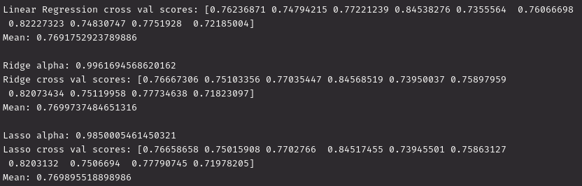

# Team Members
Ryan Varnell\
varnellr18@students.ecu.edu
# Cross Validation Scores & Alpha Values
It varies per-run, here's one example:\
\

# Which Model Performs Best?
It seems to be pretty consistently Ridge, though by a miniscule margin.