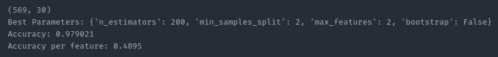

# Team Members
Ryan Varnell, varnellr18@students.ecu.edu

# Hyperparameters Used
n_estimators: [20, 50, 100, 200]\
max_features: [2, 4]\
min_samples_split: [2, 4]\
bootstrap: [True, False]

# Accuracy and (Accuracy/Number of Features)
Varies by run, but consistently over 0.92 and 0.45, respectively. Example run:\
